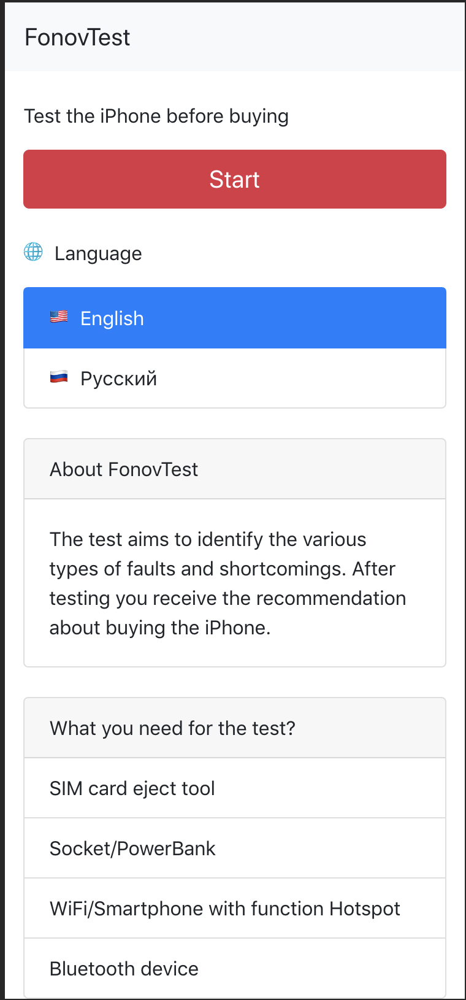

# О FonovTest
Тест для проверки iPhone перед покупкой. Тест направлен на выявление различного рода неисправностей и недостатков. После прохождения теста Вы получите рекомендации относительно покупки iPhone.

# Зачем это нужно?
Большинство людей не знают как провести полную диагностику iPhone перед покупкой, а это чревато потерей времени, денег и нервов. FonovTest направлен на то, чтобы каждый человек в независимости от его познаний в iPhone, мог провести его полную диагностику перед покупкой, аргументированно снизить цену из-за выявленных недостатков и купить исправный iPhone без скрытых дефектов.

# Почему мы?
FonovTest абсолютно бесплатный и не содержит рекламу. Мы проводим полное тестирование iPhone как снаружи, так и изнутри. Наш тест поддерживает несколько языков. Наша миссия - помогать людям экономить время, деньги и нервы. Мы постоянно развиваем FonovTest и совершенствуем его каждый день.

# Что нужно для теста?
* Скрепка
* Розетка/PowerBank
* WiFi/Смартфон с функцией раздачи Wi-Fi
* Bluetooth устройство

# Автор
Fonov Sergei - [ask@mounlion.com](mailto:ask@mounlion.com)

